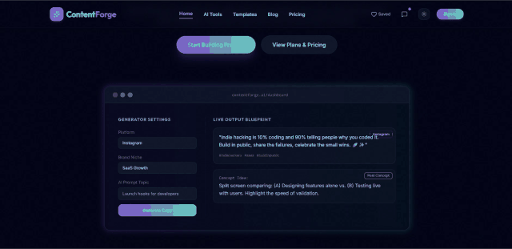
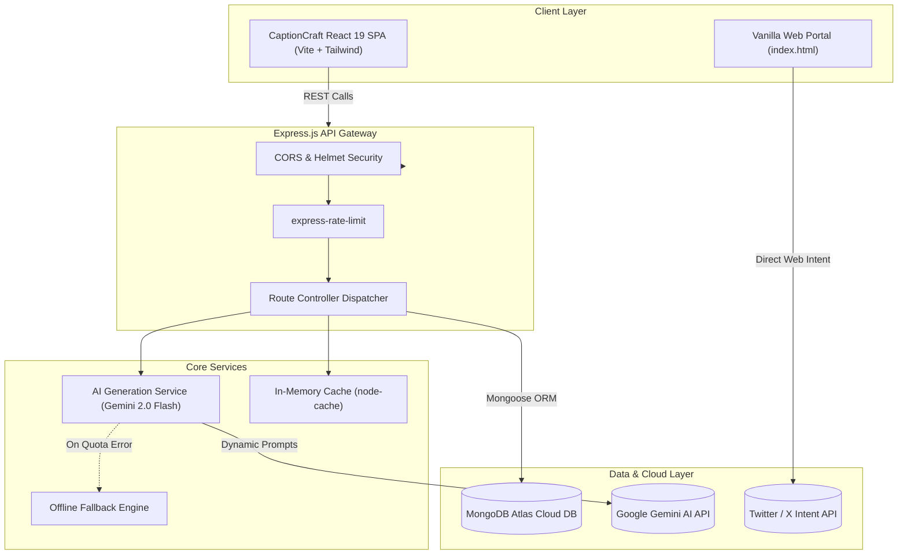

<!-- 1. Centered Header -->
<p align="center">
  
</p>

<h1 align="center">✨ Motivational Quotes & CaptionCraft AI</h1>

<p align="center">
  <strong>An enterprise-grade, multi-platform AI copywriting and motivational content ecosystem powered by Google Gemini 2.0 Flash.</strong><br>
  <em>Architected with a dual-tier framework: an ultra-lightweight zero-dependency client and an extensible React 19 + Express + MongoDB Atlas SaaS suite with automated fallback degradation.</em>
</p>

<p align="center">
  
  
  
  
  
  
  
  
  
</p>

<p align="center">
  <a href="#-overview">Overview</a> •
  <a href="#-visual-showcase">Visual Showcase</a> •
  <a href="#-key-features">Key Features</a> •
  <a href="#-system-architecture">Architecture</a> •
  <a href="#-tools--platform-breakdown">Tools Breakdown</a> •
  <a href="#-api--system-contracts">API Contracts</a> •
  <a href="#-tech-stack">Tech Stack</a> •
  <a href="#-quickstart">Quickstart</a> •
  <a href="#-project-roadmap">Roadmap</a> •
  <a href="#-author">Author</a> •
  <a href="#-license">License</a>
</p>

---

## 🌟 Overview

**Motivational Quotes & CaptionCraft AI** bridges the gap between simple static quote displays and intelligent, high-velocity social media content generation. Designed from the ground up to empower content creators, social media managers, and everyday users, the repository delivers a two-pronged solution:

1. **Lightweight Zen Client (Root)**: A sub-millisecond, dependency-free motivational quote generator built with semantic HTML5, CSS custom properties, and modern ES6+ vanilla JavaScript with instant Twitter / X Web Intent broadcasting.
2. **CaptionCraft AI SaaS Engine (`captioncraft-ai/`)**: A production-ready, full-stack AI platform incorporating **Google Gemini 2.0 Flash**, a high-performance **Express** backend, **MongoDB Atlas** persistence, **React 19** with **Vite** and **Framer Motion**, and tailored prompt pipelines for Instagram, Facebook, and Pinterest.

```text
⚡ Zero-Latency Client  |  🤖 Gemini 2.0 Flash AI  |  🌐 Bilingual (EN / HI)  |  🔒 Enterprise Resilience  |  🏆 Production Ready
```

---

## 📸 Visual Showcase

<div align="center">
  <h3>🎬 Live Platform Demo & Walkthrough</h3>
  
  <p align="center">
    <em>⚡ Continuous live demo: Gemini 2.0 Flash AI caption generation, real-time chatbot ideation, dynamic Masonry feeds, and instant clipboard workflows.</em>
  </p>
  <p align="center">
    <a href="https://github.com/Hexecutionerr/motivational-quotes/raw/main/screenshots/DemoVideo.mp4">
      
    </a>
  </p>
</div>

<br>

<div align="center">
  <h3>✨ Dual-Interface Ecosystem</h3>
</div>

<div align="center">
  <table>
    <tr>
      <td align="center" width="50%">
        <strong>⚡ Zen Quote Generator (Vanilla Portal)</strong><br><br>
        <pre>
┌──────────────────────────────────────────────────┐
│             Motivational Quotes                  │
│  ┌────────────────────────────────────────────┐  │
│  │ "The best time to plant a tree was 20       │  │
│  │  years ago. The second best time is now."  │  │
│  │                                            │  │
│  │                       — Chinese Proverb    │  │
│  └────────────────────────────────────────────┘  │
│          [ New Quote ]      [ Tweet ]            │
│       Made by Hasnain Khan • Simple Web Project  │
└──────────────────────────────────────────────────┘
        </pre>
        <em>Sub-millisecond render, zero bundle overhead, obsidian dark theme with glassmorphic cards and 1-click Twitter Web Intent sharing.</em>
      </td>
      <td align="center" width="50%">
        <strong>🤖 CaptionCraft AI SaaS Suite</strong><br><br>
        <pre>
┌──────────────────────────────────────────────────┐
│ 🌸 CaptionCraft AI   [Feed] [Chat] [Ideas] [Saved]│
│  ┌───────────────────┐    ┌───────────────────┐  │
│  │ ⚡ Motivation     │    │ 📸 Instagram Post │  │
│  │ "Push through the │    │ "Golden hour hits │  │
│  │  storm; your halo │    │  different when   │  │
│  │  awaits."         │    │  you're chasing   │  │
│  │ #Grind #Discipline│    │  dreams." ✨       │  │
│  │ [Copy] [♥ Save]   │    │ [Copy] [♥ Save]   │  │
│  └───────────────────┘    └───────────────────┘  │
│   🤖 Gemini 2.0 Engine | Masonry Grid | Bilingual│
└──────────────────────────────────────────────────┘
        </pre>
        <em>React 19 + Framer Motion reactive masonry layout, multi-platform category filtering, and real-time AI generation.</em>
      </td>
    </tr>
  </table>
</div>

---

## 🚀 Key Features

### ⚡ 1. Ultra-Lightweight Core Quote Engine
- **Instant Random Picker**: Non-blocking randomized quote selection with deterministic state management in vanilla JavaScript.
- **Native Twitter / X Intent**: One-click sharing via URI-encoded query intents (`https://twitter.com/intent/tweet?text=...`) directly opening a formatted tweet window.
- **Obsidian Glassmorphic UI**: CSS custom variables (`--bg`, `--card`, `--accent`, `--text`), linear gradient background depth, and responsive typography scaling across viewports.

### 🤖 2. CaptionCraft AI Generation Suite (Gemini 2.0 Flash)
- **Deep Context Prompt Engineering**: Bespoke prompt templates engineered for Gemini 2.0 Flash returning structured JSON arrays with contextual captions, relevant emojis, and viral hashtag clusters.
- **10+ Micro-Content Tools**: Dedicated generators for Instagram Captions, Reel Hooks, Bio Optimization, Post Idea Brainstorming, Product Copy, and Motivational Quotes.
- **🌐 Bilingual Generation**: Seamless support for both English and Hindi content generation.
- **💬 Real-Time Conversational AI (Chatbot Mode)**: Interactive assistant providing real-time brainstorming, tone adjustments, and situation-specific social strategies.

### 💾 3. Persistence & User Collections
- **1-Click Clipboard Integration**: Instant visual feedback with copy confirmation across all devices.
- **Curated Favorites Library**: Heart-to-bookmark system storing favorites locally via `localStorage` with cloud synchronization hooks to MongoDB Atlas.

### 🛡️ 4. Enterprise Resilience & Security
- **Windows DNS SRV Fallback Resolver**: Solves Node.js Windows-specific SRV lookup failures on `mongodb+srv://` connections by falling back automatically to Google DNS (`8.8.8.8`).
- **Graceful Quota Degradation**: Automated fallback engine pre-loaded with curated aesthetic content if Gemini API rate limits or network dropouts occur.
- **Rate Limiting & Threat Protection**: Protected by `express-rate-limit` to prevent denial-of-service and API key drain, paired with `helmet` header hardening.

---

## 🏗️ System Architecture



---

## 🎮 Tools & Platform Breakdown

| Module | Target Platform | Tone / Genre | Processing Pipeline | Core Artifact |
|:---|:---:|:---:|:---:|:---|
| **Zen Quote Generator** | Web / Twitter | Inspiring & Classic | Client-Side ES6+ Engine | Instant Tweet Intent |
| **Instagram Captions** | Instagram Reels / Feed | Aesthetic, Trendy, Punchy | Gemini 2.0 Flash Prompt | 5x Captions + Hashtags |
| **Post Idea Strategist** | Multi-Platform | Creative, Viral, Strategic | Gemini Structured JSON | Visual Hook + Concept Guide |
| **Bilingual Motivator** | Social & Personal | Uplifting (English / Hindi) | Gemini Dual-Lang Pipeline | Formatted Quotes + Context |
| **Conversational Chat** | Interactive Web | Inquisitive & Adaptive | Gemini Chat Context Session | Real-Time Ideation Stream |
| **Saved Library** | Private Dashboard | User Bookmarks | LocalStorage + Mongo Hooks | Persistent Collection |

---


## 💻 Tech Stack

- **Core Web (Lightweight Tier):** HTML5 Semantic Markup, CSS3 (Custom Variables, Flexbox, Media Queries), Vanilla JavaScript (ES6+).
- **Frontend SPA (CaptionCraft AI):** React 19, Vite, Tailwind CSS 3.4, Framer Motion, Lucide React, Axios, React Router DOM 7.
- **Backend Runtime:** Node.js 18+, Express.js, Mongoose ODM, Morgan, Helmet, CORS, Express-Rate-Limit.
- **Database & Cache:** MongoDB Atlas (Cloud NoSQL), In-Memory `node-cache`.
- **Artificial Intelligence:** Google Gemini 2.0 Flash SDK (`@google/genai` / `@google/generative-ai`).
- **Resilience Engineering:** Node.js DNS Resolver with Google Public DNS (`8.8.8.8`), Graceful Fallback Buffers.

---

## ⚡ Quickstart

### Option 1: Run the Instant Zen Quote Generator (Zero Setup)
Simply double-click `index.html` or serve it via any static file server:

```bash
# Clone the repository
git clone https://github.com/Hexecutionerr/motivational-quotes.git
cd motivational-quotes

# Open in your browser (Windows)
start index.html
```

---

### Option 2: Run the Full CaptionCraft AI SaaS Suite

#### 1. Prerequisites
- **Node.js**: v18.0.0 or higher
- **MongoDB**: Local MongoDB instance or free [MongoDB Atlas Cluster](https://www.mongodb.com/atlas)
- **Google Gemini API Key**: Obtainable from [Google AI Studio](https://aistudio.google.com/)

#### 2. Environment Configuration
Navigate to `captioncraft-ai/server` and create a `.env` file:

```env
PORT=5000
NODE_ENV=development
MONGODB_URI=mongodb://localhost:27017/captioncraft
JWT_SECRET=your_super_secret_jwt_key
JWT_EXPIRE=30d
GEMINI_API_KEY=your_gemini_api_key_here
CLIENT_URL=http://localhost:5173
```

#### 3. Installation & Database Seeding

```bash
# From the captioncraft-ai directory:
cd captioncraft-ai

# Install backend dependencies
cd server
npm install

# (Optional) Seed the database with initial curated content
npm run seed

# Install frontend dependencies
cd ../client
npm install
```

#### 4. Launching the Development Servers

```bash
# Terminal 1: Launch the Backend API
cd captioncraft-ai/server
npm run dev

# Terminal 2: Launch the React Client
cd captioncraft-ai/client
npm run dev
```

Visit `http://localhost:5173` to explore CaptionCraft AI!

---

## 🗺️ Project Roadmap

| Phase | Milestone | Highlights | Status |
|:---:|---|---|:---:|
| **01** | **Core Zen Quote Engine** | Lightweight zero-dependency HTML/CSS/JS generator with 1-click Twitter intent sharing | ✅ Complete |
| **02** | **CaptionCraft AI Architecture** | Full-stack React 19 + Express + MongoDB + Google Gemini 2.0 Flash integration | ✅ Complete |
| **03** | **Resilience & Production Hardening** | Windows DNS SRV fallback, offline graceful degradation, rate limiting, and PWA integration | ✅ Complete |
| **04** | **Direct Social Publishing & Analytics** | Native Instagram Graph API / Pinterest API publishing and copy-engagement analytics | 🚀 In Progress |

---

## 👨‍💻 Author

**Hasnain Khan**  
*Lead Developer & Architect*

- [GitHub](https://github.com/Hexecutionerr)
- [LinkedIn](https://www.linkedin.com/in/hasnain-khan-0ab3b2320)

---

## 📄 License

This project is licensed under the **MIT License** — see the [LICENSE](LICENSE) file for details.
