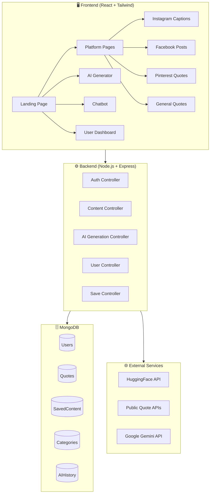
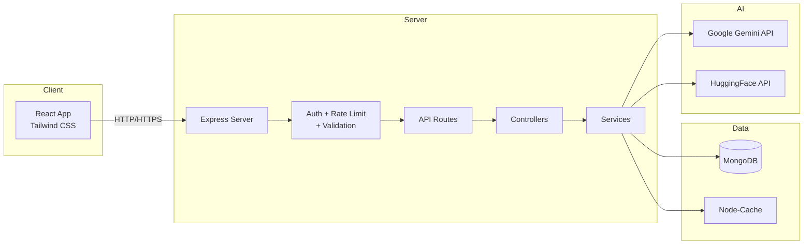

# 🎨 CaptionCraft AI — Product Architecture Document

> **Agent 1: Product Architect** | Version 1.0 | April 2026
> **Author:** AI Product Architect Agent

---

## 📋 Table of Contents

1. [Executive Summary](#executive-summary)
2. [System Overview](#system-overview)
3. [Core Features](#core-features)
4. [System Architecture](#system-architecture)
5. [Database Schemas](#database-schemas)
6. [API Endpoints](#api-endpoints)
7. [UI/UX Design System](#uiux-design-system)
8. [Folder Structure](#folder-structure)
9. [External Integrations](#external-integrations)
10. [Security & Performance](#security--performance)
11. [Deployment Strategy](#deployment-strategy)

---

## 1. Executive Summary

**CaptionCraft AI** is a modern, AI-powered Social Content Generation SaaS platform that enables content creators, students, influencers, and general users to discover, scroll, and generate high-quality quotes, captions, and post ideas for Instagram, Facebook, Pinterest, and other social platforms.

The platform combines a curated content library with real-time AI generation capabilities, supporting both Hindi and English languages.

### Key Value Propositions
- 🔥 **Infinite Scroll Feed** — Instagram/Pinterest-like discovery experience
- 🤖 **AI-Powered Generation** — Mood/situation-based caption generation
- 💬 **Chatbot Mode** — Conversational content generation
- 🌐 **Multi-Platform** — Tailored content for Instagram, Facebook, Pinterest
- 🇮🇳 **Bilingual** — Hindi + English support
- 💾 **Save & Copy** — Clipboard copy + favorites system

---

## 2. System Overview



---

## 3. Core Features

### 3.1 Platform-Based Pages

| Page | Route | Description |
|------|-------|-------------|
| **Instagram Captions** | `/instagram` | Curated captions for Instagram posts, reels, stories |
| **Facebook Posts** | `/facebook` | Shareable quotes and post ideas for Facebook |
| **Pinterest Quotes** | `/pinterest` | Aesthetic, visual-ready quotes for Pinterest boards |
| **General Quotes** | `/quotes` | Motivational, life, and category-based quotes |
| **AI Generator** | `/generate` | AI-powered content generation page |
| **Chatbot** | `/chat` | Conversational AI for content |

### 3.2 Content Feed System

- **Infinite Scroll**: Virtualized list with lazy loading (20 items per batch)
- **Card-Based UI**: Each quote rendered as a beautiful card with:
  - Quote/Caption text
  - Author name (real or AI-attributed)
  - Category badge (love, sad, hustle, etc.)
  - Platform tag (Instagram, Facebook, etc.)
  - Copy button (one-tap clipboard)
  - Save/Favorite heart button
  - Share button
- **Filter & Sort**: By category, language, popularity, recency
- **Search**: Full-text search across all content

### 3.3 Quote/Caption Structure

```json
{
  "id": "ObjectId",
  "text": "The only way to do great work is to love what you do.",
  "textHindi": "महान काम करने का एकमात्र तरीका यह है कि आप जो करते हैं उससे प्यार करें।",
  "author": "Steve Jobs",
  "category": "motivation",
  "platform": ["instagram", "facebook"],
  "tags": ["hustle", "work", "passion"],
  "language": "en",
  "isAIGenerated": false,
  "likes": 1234,
  "copies": 567,
  "createdAt": "2026-04-09T00:00:00Z"
}
```

### 3.4 AI Generation System

**Flow:**
1. User selects mood/platform/category
2. Optionally enters a situation description
3. Clicks "Generate"
4. AI returns 3-5 options:
   - Caption (platform-optimized)
   - Quote (standalone)
   - Post idea (with emojis and hashtags)
5. User can copy, save, or regenerate

### 3.5 Chatbot Mode

- Conversational interface for content generation
- Example interactions:
  - User: "Breakup caption chahiye" → AI returns 5 caption options
  - User: "Gym motivation in Hindi" → AI returns Hindi fitness quotes
  - User: "Birthday wish for best friend" → AI returns creative wishes
- Chat history saved per user session

### 3.6 Categories

| Category | Icon | Color |
|----------|------|-------|
| Love | ❤️ | `#FF6B8A` |
| Sad | 😢 | `#7B8CDE` |
| Motivation | 🔥 | `#FF9F43` |
| Study | 📚 | `#54A0FF` |
| Gym/Fitness | 💪 | `#5F27CD` |
| Attitude | 😎 | `#FF6348` |
| Friendship | 🤝 | `#26DE81` |
| Success | 🏆 | `#FFC312` |
| Life | 🌱 | `#2ED573` |
| Humor | 😂 | `#FF4757` |
| Birthday | 🎂 | `#F8A5C2` |
| Travel | ✈️ | `#3742FA` |

---

## 4. System Architecture

### 4.1 Tech Stack

| Layer | Technology | Purpose |
|-------|-----------|---------|
| **Frontend** | React 18 + Vite | UI framework |
| **Styling** | Tailwind CSS | Baby pink aesthetic UI |
| **State Mgmt** | React Context + useReducer | Global state |
| **HTTP Client** | Axios | API communication |
| **Backend** | Node.js 20 + Express 4 | REST API server |
| **Database** | MongoDB + Mongoose | Data persistence |
| **Auth** | JWT + bcrypt | Authentication |
| **AI** | Google Gemini / HuggingFace | Content generation |
| **Cache** | Node-cache (in-memory) | Performance caching |
| **Validation** | Joi / express-validator | Input validation |
| **Rate Limiting** | express-rate-limit | API protection |

### 4.2 Architecture Diagram



---

## 5. Database Schemas

### 5.1 Users Collection

```javascript
const UserSchema = new mongoose.Schema({
  name: { type: String, required: true, trim: true },
  email: { type: String, required: true, unique: true, lowercase: true },
  password: { type: String, required: true, minlength: 6 },
  avatar: { type: String, default: '' },
  preferredLanguage: { type: String, enum: ['en', 'hi', 'both'], default: 'both' },
  savedQuotes: [{ type: mongoose.Schema.Types.ObjectId, ref: 'Quote' }],
  generationCount: { type: Number, default: 0 },
  plan: { type: String, enum: ['free', 'pro', 'premium'], default: 'free' },
  isVerified: { type: Boolean, default: false },
  lastLogin: { type: Date },
  createdAt: { type: Date, default: Date.now },
  updatedAt: { type: Date, default: Date.now }
});
```

### 5.2 Quotes Collection

```javascript
const QuoteSchema = new mongoose.Schema({
  text: { type: String, required: true },
  textHindi: { type: String, default: '' },
  author: { type: String, default: 'Unknown' },
  category: { 
    type: String, 
    required: true,
    enum: ['love', 'sad', 'motivation', 'study', 'gym', 'attitude', 
           'friendship', 'success', 'life', 'humor', 'birthday', 'travel']
  },
  platforms: [{ 
    type: String, 
    enum: ['instagram', 'facebook', 'pinterest', 'general'] 
  }],
  tags: [{ type: String }],
  language: { type: String, enum: ['en', 'hi'], default: 'en' },
  isAIGenerated: { type: Boolean, default: false },
  generatedBy: { type: mongoose.Schema.Types.ObjectId, ref: 'User' },
  likes: { type: Number, default: 0 },
  copies: { type: Number, default: 0 },
  shares: { type: Number, default: 0 },
  isPublic: { type: Boolean, default: true },
  hashtags: [{ type: String }],
  emojis: { type: String, default: '' },
  createdAt: { type: Date, default: Date.now }
});

// Indexes for performance
QuoteSchema.index({ category: 1, platforms: 1 });
QuoteSchema.index({ text: 'text', textHindi: 'text' });
QuoteSchema.index({ createdAt: -1 });
QuoteSchema.index({ likes: -1 });
```

### 5.3 SavedContent Collection

```javascript
const SavedContentSchema = new mongoose.Schema({
  userId: { type: mongoose.Schema.Types.ObjectId, ref: 'User', required: true },
  quoteId: { type: mongoose.Schema.Types.ObjectId, ref: 'Quote', required: true },
  savedAt: { type: Date, default: Date.now },
  folder: { type: String, default: 'default' },
  notes: { type: String, default: '' }
});

SavedContentSchema.index({ userId: 1, quoteId: 1 }, { unique: true });
```

### 5.4 Categories Collection

```javascript
const CategorySchema = new mongoose.Schema({
  name: { type: String, required: true, unique: true },
  slug: { type: String, required: true, unique: true },
  displayName: { type: String, required: true },
  displayNameHindi: { type: String, default: '' },
  icon: { type: String, required: true },
  color: { type: String, required: true },
  description: { type: String, default: '' },
  quoteCount: { type: Number, default: 0 },
  isActive: { type: Boolean, default: true },
  order: { type: Number, default: 0 }
});
```

### 5.5 AIHistory Collection

```javascript
const AIHistorySchema = new mongoose.Schema({
  userId: { type: mongoose.Schema.Types.ObjectId, ref: 'User', required: true },
  prompt: { type: String, required: true },
  response: [{ type: String }],
  platform: { type: String },
  category: { type: String },
  language: { type: String, enum: ['en', 'hi'], default: 'en' },
  model: { type: String, default: 'gemini' },
  type: { type: String, enum: ['generate', 'chat'], required: true },
  createdAt: { type: Date, default: Date.now }
});

AIHistorySchema.index({ userId: 1, createdAt: -1 });
```

---

## 6. API Endpoints

### 6.1 Authentication (`/api/auth`)

| Method | Endpoint | Description | Auth |
|--------|----------|-------------|------|
| `POST` | `/api/auth/register` | Register new user | ❌ |
| `POST` | `/api/auth/login` | Login user | ❌ |
| `POST` | `/api/auth/logout` | Logout user | ✅ |
| `GET` | `/api/auth/me` | Get current user | ✅ |
| `POST` | `/api/auth/forgot-password` | Send reset email | ❌ |
| `PUT` | `/api/auth/reset-password/:token` | Reset password | ❌ |

### 6.2 Content (`/api/content`)

| Method | Endpoint | Description | Auth |
|--------|----------|-------------|------|
| `GET` | `/api/content/quotes` | Get all quotes (paginated) | ❌ |
| `GET` | `/api/content/quotes/:id` | Get single quote | ❌ |
| `GET` | `/api/content/platform/:platform` | Get by platform | ❌ |
| `GET` | `/api/content/category/:category` | Get by category | ❌ |
| `GET` | `/api/content/search?q=...` | Search quotes | ❌ |
| `GET` | `/api/content/trending` | Get trending quotes | ❌ |
| `GET` | `/api/content/random` | Get random quotes | ❌ |
| `POST` | `/api/content/quotes` | Create quote (admin) | ✅ |
| `PUT` | `/api/content/quotes/:id/like` | Like a quote | ✅ |
| `PUT` | `/api/content/quotes/:id/copy` | Increment copy count | ❌ |

### 6.3 AI Generation (`/api/generate`)

| Method | Endpoint | Description | Auth |
|--------|----------|-------------|------|
| `POST` | `/api/generate/caption` | Generate AI caption | ✅ |
| `POST` | `/api/generate/quote` | Generate AI quote | ✅ |
| `POST` | `/api/generate/post-idea` | Generate post idea | ✅ |
| `POST` | `/api/generate/chat` | Chatbot message | ✅ |
| `GET` | `/api/generate/history` | Get generation history | ✅ |

**Request Body Example:**
```json
{
  "mood": "happy",
  "platform": "instagram",
  "category": "love",
  "situation": "Just got engaged!",
  "language": "en",
  "count": 5
}
```

### 6.4 Saved Content (`/api/save`)

| Method | Endpoint | Description | Auth |
|--------|----------|-------------|------|
| `POST` | `/api/save/:quoteId` | Save a quote | ✅ |
| `DELETE` | `/api/save/:quoteId` | Unsave a quote | ✅ |
| `GET` | `/api/save` | Get all saved quotes | ✅ |
| `GET` | `/api/save/folders` | Get save folders | ✅ |
| `POST` | `/api/save/folders` | Create folder | ✅ |

### 6.5 User (`/api/user`)

| Method | Endpoint | Description | Auth |
|--------|----------|-------------|------|
| `GET` | `/api/user/profile` | Get user profile | ✅ |
| `PUT` | `/api/user/profile` | Update profile | ✅ |
| `GET` | `/api/user/stats` | Get user stats | ✅ |
| `DELETE` | `/api/user/account` | Delete account | ✅ |

### 6.6 Categories (`/api/categories`)

| Method | Endpoint | Description | Auth |
|--------|----------|-------------|------|
| `GET` | `/api/categories` | Get all categories | ❌ |
| `GET` | `/api/categories/:slug` | Get category details | ❌ |

---

## 7. UI/UX Design System

### 7.1 Color Palette — Baby Pink Aesthetic 🌸

```css
:root {
  /* Primary - Baby Pink */
  --primary-50:  #FFF0F5;
  --primary-100: #FFE4EE;
  --primary-200: #FFCCE0;
  --primary-300: #FFB3D1;
  --primary-400: #FF8CB8;
  --primary-500: #FF6B9D;  /* Main brand */
  --primary-600: #E84D80;
  --primary-700: #D03A6B;
  --primary-800: #B02856;
  --primary-900: #8E1E43;

  /* Accent - Soft Lavender */
  --accent-50:  #F5F0FF;
  --accent-100: #EDE4FF;
  --accent-200: #D9C7FF;
  --accent-300: #C5AAFF;
  --accent-400: #A880FF;
  --accent-500: #8B5CF6;

  /* Neutral */
  --neutral-50:  #FAFAFA;
  --neutral-100: #F5F5F5;
  --neutral-200: #E5E5E5;
  --neutral-300: #D4D4D4;
  --neutral-400: #A3A3A3;
  --neutral-500: #737373;
  --neutral-600: #525252;
  --neutral-700: #404040;
  --neutral-800: #262626;
  --neutral-900: #171717;

  /* Background */
  --bg-primary: #FFF8FA;
  --bg-secondary: #FFF0F5;
  --bg-card: #FFFFFF;
  --bg-dark: #1A1A2E;
  
  /* Gradients */
  --gradient-primary: linear-gradient(135deg, #FF6B9D 0%, #C44AE0 50%, #8B5CF6 100%);
  --gradient-card: linear-gradient(135deg, #FFF0F5 0%, #F5F0FF 100%);
  --gradient-dark: linear-gradient(135deg, #1A1A2E 0%, #16213E 100%);
}
```

### 7.2 Typography

```
Primary Font:   'Inter', sans-serif
Heading Font:   'Outfit', sans-serif
Quote Font:     'Playfair Display', serif
Hindi Font:     'Tiro Devanagari Hindi', serif
```

### 7.3 Component Design

| Component | Style |
|-----------|-------|
| **Cards** | White background, 16px rounded corners, soft shadow, pink gradient border on hover |
| **Buttons** | Pill-shaped, gradient background, subtle shadow, scale animation on hover |
| **Input Fields** | Rounded, light pink border, focus glow effect |
| **Navigation** | Glassmorphism navbar, blur effect, sticky |
| **Modals** | Centered, backdrop blur, slide-up animation |
| **Toast/Snackbar** | Bottom-right, gradient accent, auto-dismiss |

### 7.4 Page Layouts

```
┌─────────────────────────────────────────┐
│  🌸 CaptionCraft AI  [Nav] [Auth]      │  ← Glassmorphism Navbar
├─────────────────────────────────────────┤
│                                         │
│  ┌─────────────────────────────────┐    │
│  │     Hero Section / Search       │    │  ← Platform-specific hero
│  │     [Category Chips]            │    │
│  └─────────────────────────────────┘    │
│                                         │
│  ┌───────┐ ┌───────┐ ┌───────┐         │
│  │ Card  │ │ Card  │ │ Card  │         │  ← Masonry/Grid Layout
│  │ Quote │ │ Quote │ │ Quote │         │
│  │ ❤️ 📋 │ │ ❤️ 📋 │ │ ❤️ 📋 │         │
│  └───────┘ └───────┘ └───────┘         │
│                                         │
│  ┌───────┐ ┌───────┐ ┌───────┐         │  ← Infinite Scroll
│  │ Card  │ │ Card  │ │ Card  │         │
│  └───────┘ └───────┘ └───────┘         │
│                                         │
│  [Loading Spinner...]                   │  ← Lazy load indicator
│                                         │
└─────────────────────────────────────────┘
```

---

## 8. Folder Structure

```
captioncraft-ai/
├── client/                          # React Frontend
│   ├── public/
│   │   ├── favicon.ico
│   │   └── index.html
│   ├── src/
│   │   ├── assets/                  # Images, icons, fonts
│   │   │   ├── images/
│   │   │   └── icons/
│   │   ├── components/              # Reusable components
│   │   │   ├── common/
│   │   │   │   ├── Navbar.jsx
│   │   │   │   ├── Footer.jsx
│   │   │   │   ├── QuoteCard.jsx
│   │   │   │   ├── CategoryChip.jsx
│   │   │   │   ├── SearchBar.jsx
│   │   │   │   ├── LoadingSpinner.jsx
│   │   │   │   ├── Toast.jsx
│   │   │   │   └── InfiniteScroll.jsx
│   │   │   ├── ai/
│   │   │   │   ├── GeneratorForm.jsx
│   │   │   │   ├── ChatBot.jsx
│   │   │   │   ├── ChatMessage.jsx
│   │   │   │   └── ResultCard.jsx
│   │   │   ├── auth/
│   │   │   │   ├── LoginForm.jsx
│   │   │   │   ├── RegisterForm.jsx
│   │   │   │   └── AuthModal.jsx
│   │   │   └── user/
│   │   │       ├── ProfileCard.jsx
│   │   │       └── SavedQuotes.jsx
│   │   ├── pages/
│   │   │   ├── Home.jsx
│   │   │   ├── Instagram.jsx
│   │   │   ├── Facebook.jsx
│   │   │   ├── Pinterest.jsx
│   │   │   ├── Quotes.jsx
│   │   │   ├── Generate.jsx
│   │   │   ├── Chat.jsx
│   │   │   ├── Profile.jsx
│   │   │   ├── Saved.jsx
│   │   │   └── NotFound.jsx
│   │   ├── context/
│   │   │   ├── AuthContext.jsx
│   │   │   ├── ContentContext.jsx
│   │   │   └── ThemeContext.jsx
│   │   ├── hooks/
│   │   │   ├── useAuth.js
│   │   │   ├── useInfiniteScroll.js
│   │   │   ├── useQuotes.js
│   │   │   └── useGenerate.js
│   │   ├── services/
│   │   │   ├── api.js
│   │   │   ├── authService.js
│   │   │   ├── contentService.js
│   │   │   └── aiService.js
│   │   ├── utils/
│   │   │   ├── constants.js
│   │   │   ├── helpers.js
│   │   │   └── validators.js
│   │   ├── App.jsx
│   │   ├── main.jsx
│   │   └── index.css
│   ├── tailwind.config.js
│   ├── postcss.config.js
│   ├── vite.config.js
│   └── package.json
│
├── server/                          # Node.js Backend
│   ├── config/
│   │   ├── db.js
│   │   ├── env.js
│   │   └── cors.js
│   ├── controllers/
│   │   ├── authController.js
│   │   ├── contentController.js
│   │   ├── generateController.js
│   │   ├── saveController.js
│   │   └── userController.js
│   ├── middleware/
│   │   ├── auth.js
│   │   ├── errorHandler.js
│   │   ├── rateLimiter.js
│   │   └── validation.js
│   ├── models/
│   │   ├── User.js
│   │   ├── Quote.js
│   │   ├── SavedContent.js
│   │   ├── Category.js
│   │   └── AIHistory.js
│   ├── routes/
│   │   ├── authRoutes.js
│   │   ├── contentRoutes.js
│   │   ├── generateRoutes.js
│   │   ├── saveRoutes.js
│   │   ├── userRoutes.js
│   │   └── categoryRoutes.js
│   ├── services/
│   │   ├── aiService.js
│   │   ├── quoteService.js
│   │   └── cacheService.js
│   ├── seeds/
│   │   ├── categories.js
│   │   └── quotes.js
│   ├── utils/
│   │   ├── apiResponse.js
│   │   └── helpers.js
│   ├── server.js
│   ├── .env.example
│   └── package.json
│
├── .gitignore
├── README.md
└── package.json                     # Root package.json (scripts)
```

---

## 9. External Integrations

### 9.1 AI Content Generation

| Provider | Use Case | Priority |
|----------|----------|----------|
| **Google Gemini API** | Primary content generation, chatbot | 🥇 Primary |
| **HuggingFace Inference** | Fallback generation, sentiment analysis | 🥈 Secondary |
| **ZenQuotes API** | Bulk quote fetching | 🥉 Data Source |
| **Quotable API** | Random quote generation | 🥉 Data Source |

### 9.2 AI Prompt Templates

**Caption Generation:**
```
Generate {count} creative {platform} captions about {category}.
Mood: {mood}
Situation: {situation}
Language: {language}
Include relevant emojis and hashtags.
Each caption should be unique and engaging.
```

**Chatbot System Prompt:**
```
You are CaptionCraft AI, a friendly and creative social media content assistant.
You specialize in generating captions, quotes, and post ideas.
You can respond in both Hindi and English based on user preference.
Keep responses fun, engaging, and optimized for social media.
Always provide multiple options when generating content.
```

---

## 10. Security & Performance

### 10.1 Security Measures

- ✅ **JWT Authentication** with HTTP-only cookies
- ✅ **Password Hashing** with bcrypt (12 salt rounds)
- ✅ **Rate Limiting**: 100 req/min (general), 10 req/min (AI generation)
- ✅ **Input Validation** with express-validator
- ✅ **CORS** configured for frontend origin only
- ✅ **Helmet.js** for HTTP security headers
- ✅ **MongoDB Injection Prevention** with mongo-sanitize
- ✅ **XSS Protection** with xss-clean

### 10.2 Performance Optimizations

- ✅ **Response Caching** — Popular quotes cached for 1 hour
- ✅ **Database Indexing** — Compound indexes on category, platform, date
- ✅ **Pagination** — Cursor-based for infinite scroll
- ✅ **Image Lazy Loading** — Intersection Observer API
- ✅ **Code Splitting** — React.lazy + Suspense for route-based splitting
- ✅ **Gzip Compression** — Express compression middleware
- ✅ **Connection Pooling** — Mongoose connection pool (10 connections)

---

## 11. Deployment Strategy

### 11.1 Environment Variables

```env
# Server
PORT=5000
NODE_ENV=development

# MongoDB
MONGODB_URI=mongodb://localhost:27017/captioncraft

# JWT
JWT_SECRET=your-super-secret-key-here
JWT_EXPIRE=30d
JWT_COOKIE_EXPIRE=30

# AI APIs
GEMINI_API_KEY=your-gemini-api-key
HUGGINGFACE_API_KEY=your-hf-api-key

# Frontend
CLIENT_URL=http://localhost:5173

# Rate Limiting
RATE_LIMIT_WINDOW=15
RATE_LIMIT_MAX=100
AI_RATE_LIMIT_MAX=10
```

### 11.2 NPM Scripts

```json
{
  "scripts": {
    "dev": "concurrently \"npm run server\" \"npm run client\"",
    "server": "cd server && nodemon server.js",
    "client": "cd client && npm run dev",
    "build": "cd client && npm run build",
    "seed": "cd server && node seeds/index.js",
    "start": "cd server && node server.js"
  }
}
```

---

## 12. Development Phases

### Phase 1: Foundation (Current — Agent 1) ✅
- [x] Product architecture document
- [x] Database schema design
- [x] API endpoint design
- [x] UI/UX design system
- [x] Folder structure planning
- [x] Project scaffolding

### Phase 2: Backend Development (Agent 2)
- [ ] Express server setup
- [ ] MongoDB models implementation
- [ ] Auth system (register/login/JWT)
- [ ] Content CRUD APIs
- [ ] AI generation integration
- [ ] Seed database with quotes

### Phase 3: Frontend Development (Agent 3)
- [ ] React + Vite + Tailwind setup
- [ ] Component library creation
- [ ] Page implementations
- [ ] Infinite scroll system
- [ ] AI generator & chatbot UI
- [ ] Auth flow integration

### Phase 4: Integration & Polish (Agent 4)
- [ ] Frontend-Backend integration
- [ ] Error handling & loading states
- [ ] Responsive design testing
- [ ] Performance optimization
- [ ] Bug fixes & polish

### Phase 5: Deployment (Agent 5)
- [ ] Production build
- [ ] Deployment to hosting
- [ ] Environment configuration
- [ ] Final testing

---

> [!IMPORTANT]
> This architecture document serves as the **single source of truth** for all agents.
> All implementation decisions should reference this document.

---

*Generated by CaptionCraft AI Product Architect Agent — April 2026*
